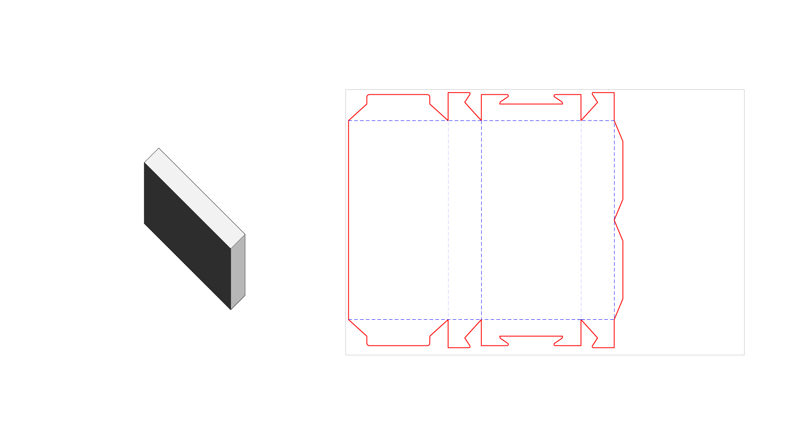
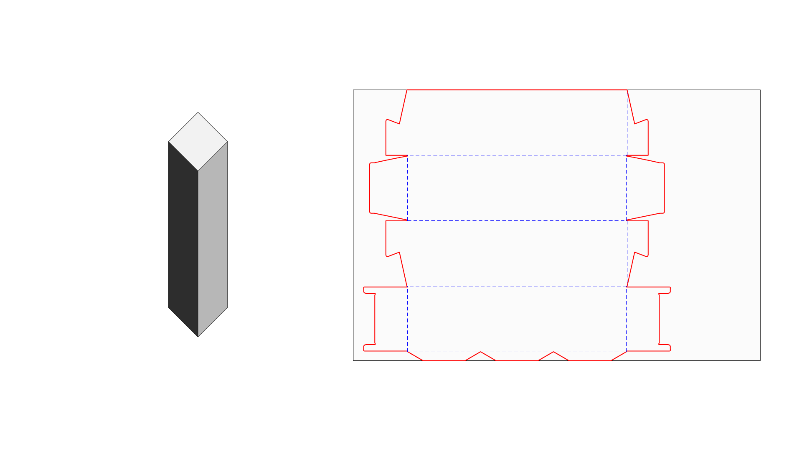
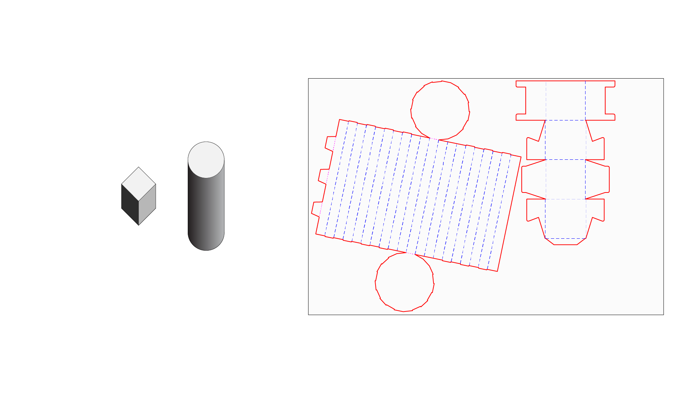
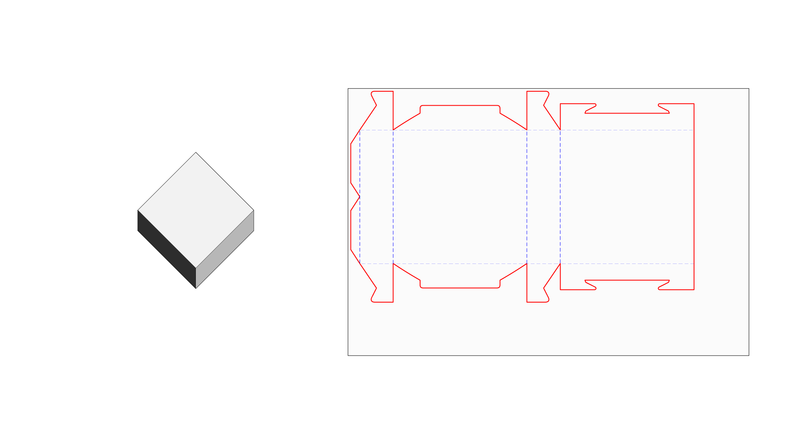
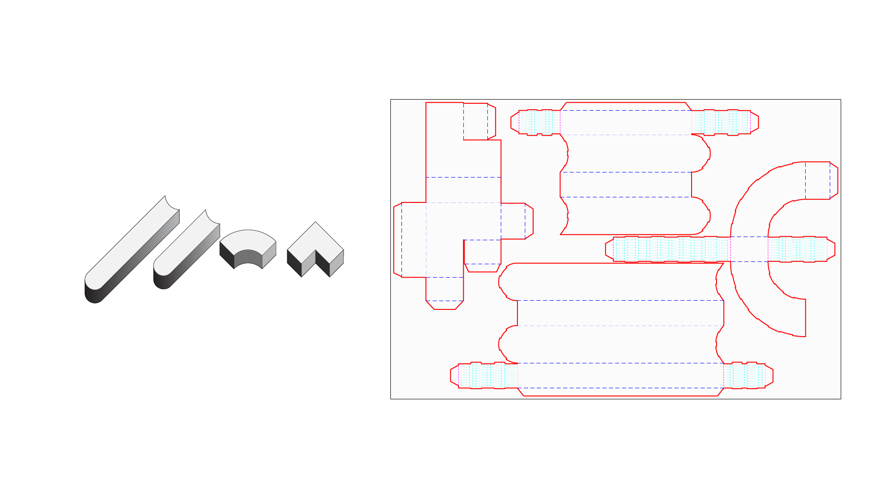

In order to help make the findings of this workshop open to a wider audeince, we've included below resources for you to make your own cardboard primitives. The strategy for making these objects included trying to find lightweight, resilient, cheap materials that were forgiving for the sake of transportation and reuse. This landed us on cardboard with minimal gluing. 

The volumes that we porduced in the end balance generic identiy while still trying to be different enough from one another. The sizes are optimized for the laser cutter that we were using. 

### Materials
Specifically, to make these objects will require using e-flute cardboard, which is appropriate for the scale of the primitives. The most commonly used cardboard is c-flute (1/8" thick), while the slighlty more rare e-flute (1/16") makes folding easier and weighs less. Our primary obstacle was transporting all of these on a fight from Boston to San Francisco, which meant flatpacking everything (hence foldable cardboard boxes), packaging it, and instead assembling them in San Francisco. 

We used 119 sheets of cardboard to produce 360 volumes. The sheets were purchased in bulk from our local art store, which ended up being cheaper than most online vendors. The sheets were cut downt to 24"x36" to fit our laser cutter.

### Lasercutting
The linked files below are all, for the most part, laser-cutting ready files. Included are the generic volumes in 3D, some guides, and they're made available in various file formats.

<a href="./IAC_Lasercut.eps" target="_blank">EPS file</a>

