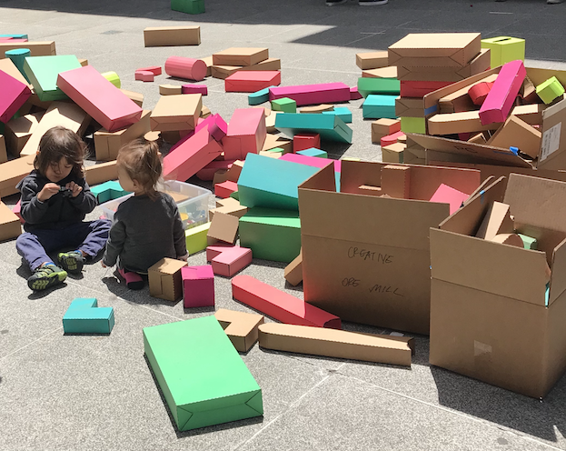
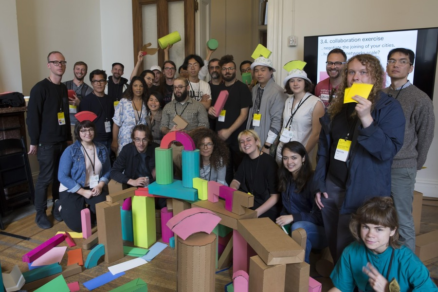

This workshop is led by a group of students and educators at MIT, that collectively call themselves Studio Pas Mal. 

<a href="" target="_blank">Agnes Cameron</a> (MIT Media Lab) 
<a href="https://kalli-retzepi.com/" target="_blank">Kalli Retzepi</a> (MIT Media Lab)  
<a href="" target="_blank">Sam Ghantous</a> (MIT Architecture) 
<a href="" target="_blank">Zhexi Zhang</a> (MIT ACT programme)  

Thank you to <a href="" target="_blank">Mindy Seu</a>  and <a href="" target="_blank">Sam Hart</a> for inviting us, and to all the people we met while there, particularly the <a href="" target="_blank">Cybernetics Library</a>  (David) and the <a href="" target="_blank">Gardens</a>  (Melanie, Dan, Callil).

The building blocks have been adopted by a grade school teacher in SF. We hope they are happy in their new home.

Thank you so much to everyone who attended!!
